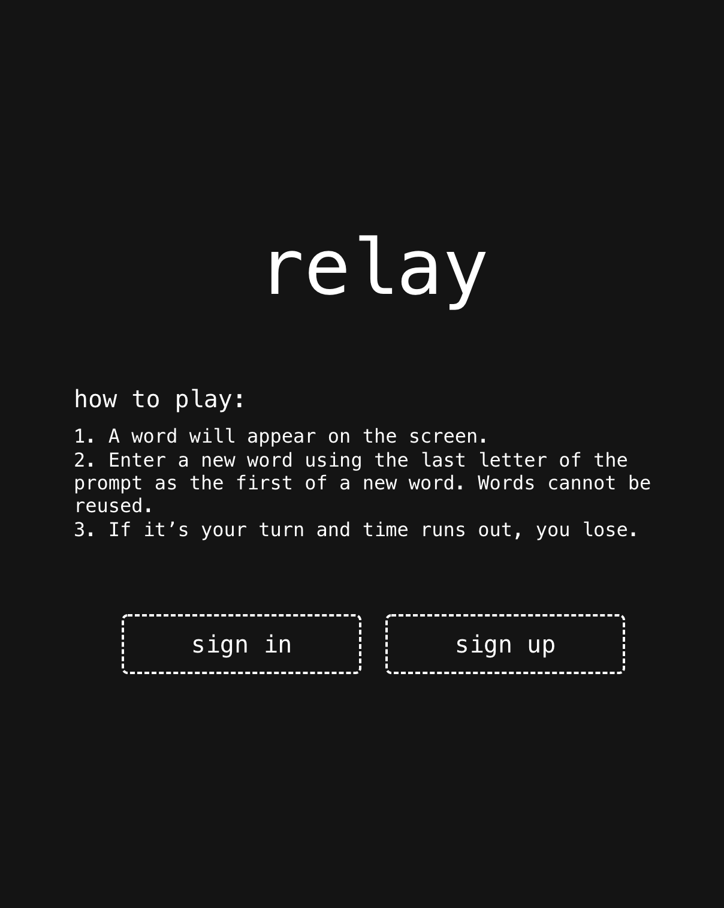
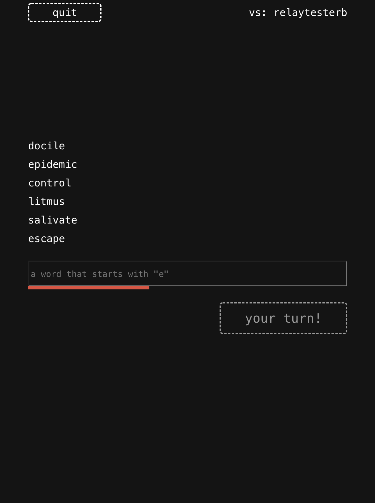

# relay

A simple realtime game where players go back and forth entering words whose first letter is the same as the last letter of the previous word. For example, "wonderful" could be followed by "lounge". If a player can't think of a word in 10 seconds, they lose.

Powered by WebSockets and AWS CDK, Lambdas, Cognito, DynamoDB, S3, and API Gateway. 

(Yes, Cognito authentication is probably unecessary for this game, but I wanted to learn it 😀)

You can try it [here]:(dqwmo9jv6saax.cloudfront.net)

## Screenshots

### Home Screen

### Game Screen

## Available Scripts

In the project directory, you can run:

### `sh deployAll.sh`

Builds and deploys the whole stack to AWS, assuming your credentials and environment variables are properly set. Also deploys the frontend React app.

### `sh deployBackend.sh`

Builds and deploys just the backend (infrastructure folder) to AWS.

### `sh integration.sh`

Runs a simple integration test with two client websockets mocking out a game. Warning: connects to production server!

### `npm start`

Runs the app in the development mode.\
Open [http://localhost:3000](http://localhost:3000) to view it in the browser.

The page will reload if you make edits.\
You will also see any lint errors in the console.

## Env variables to set:

### Server env variables

`RELAY_USER_POOL_NAME`

`RELAY_CONNECTION_URL`

`RELAY_HOSTING_BUCKET_NAME`

### Client env variables

`REACT_APP_RELAY_WEBSOCKET_URL`

`REACT_APP_RELAY_USER_POOL_ID`

`REACT_APP_RELAY_CLIENT_ID`

### Testing variables

`RELAY_TEST_USER_1_USERNAME`

`RELAY_TEST_USER_1_PASSWORD`

`RELAY_TEST_USER_1_ID`

`RELAY_TEST_USER_2_USERNAME`

`RELAY_TEST_USER_2_PASSWORD`

`RELAY_TEST_USER_2_ID`
